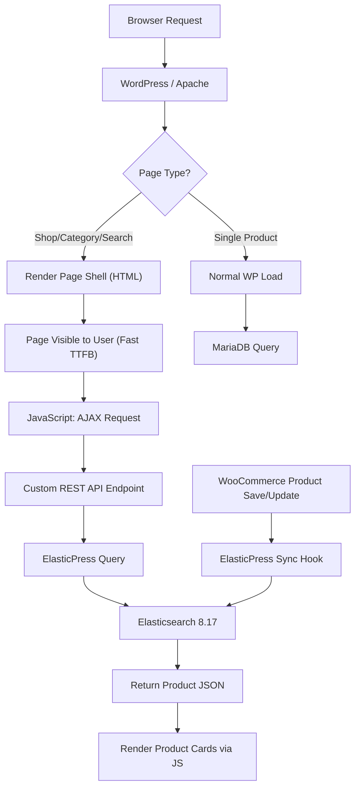

# Elasticsearch Integration — Master Plan

## Gambaran Umum

Implementasi Elasticsearch pada The Canopy Room WordPress/WooCommerce untuk mempercepat loading produk pada halaman shop, kategori, search, dan lainnya.

### Masalah Saat Ini

Ketika user membuka halaman shop/kategori di WordPress, seluruh produk di-query langsung dari MariaDB menggunakan `WP_Query` secara sinkron — artinya halaman **tidak akan tampil sampai seluruh query selesai**. Dengan 550 produk + 1.355 variasi, ini menyebabkan:

- **TTFB tinggi** — Server harus selesai query DB sebelum mengirim HTML
- **Blocking render** — User melihat halaman kosong selama query berjalan
- **Tidak scalable** — Semakin banyak produk, semakin lambat

### Solusi yang Diusulkan

Implementasi dibagi menjadi **2 strategi utama** yang saling melengkapi:

```
┌─────────────────────────────────────────────────────┐
│  STRATEGI 1: Elasticsearch sebagai Search Backend   │
│  ElasticPress plugin → index produk → fast queries  │
└─────────────────────────────────────────────────────┘
                        +
┌─────────────────────────────────────────────────────┐
│  STRATEGI 2: AJAX Product Loading                   │
│  Page load cepat → produk di-load via AJAX/REST API │
│  → Elasticsearch handles query                      │
└─────────────────────────────────────────────────────┘
```

---

## Current Stack Summary

| Component        | Detail                          |
|------------------|---------------------------------|
| WordPress        | Latest (PHP 8.3, Apache)        |
| WooCommerce      | 10.9.4 (HPOS enabled)           |
| Database         | MariaDB 11 (prefix: `cnp_`)     |
| Elasticsearch    | 8.17.0 (Docker, sudah running)  |
| Kibana           | 8.17.0 (Docker, sudah running)  |
| Theme            | Ecomus + canopy-child           |
| Products         | 550 published + 1,355 variations|
| Categories       | 41                              |
| Attributes       | 2 (size, color)                 |

> [!IMPORTANT]
> Elasticsearch container (`wp_elasticsearch`) dan Kibana (`wp_kibana`) **sudah dikonfigurasi** di Docker Compose. Endpoint: `http://wp_elasticsearch:9200` (dari container) atau `http://localhost:9200` (dari host).

---

## Task Breakdown

Planning ini dipecah menjadi **5 task** yang harus dikerjakan secara berurutan:

| Task | File | Deskripsi | Estimasi |
|------|------|-----------|----------|
| 1 | [01-elasticsearch-setup.md](file:///c:/laragon/www/tcr-wordpress/ai-task/01-elasticsearch-setup.md) | Setup ElasticPress plugin + initial indexing | 2-3 jam |
| 2 | [02-search-integration.md](file:///c:/laragon/www/tcr-wordpress/ai-task/02-search-integration.md) | Konfigurasi search, autocomplete, faceted filtering | 2-3 jam |
| 3 | [03-ajax-product-loading.md](file:///c:/laragon/www/tcr-wordpress/ai-task/03-ajax-product-loading.md) | AJAX/REST API product loading (lazy load) | 4-6 jam |
| 4 | [04-performance-optimization.md](file:///c:/laragon/www/tcr-wordpress/ai-task/04-performance-optimization.md) | Caching, query optimization, monitoring | 2-3 jam |
| 5 | [05-testing-deployment.md](file:///c:/laragon/www/tcr-wordpress/ai-task/05-testing-deployment.md) | Testing, benchmarking, deployment to production | 2-3 jam |

---

## Arsitektur Target



### Data Flow

```
1. USER membuka /shop atau /product-category/xxx
2. WordPress render page shell (header, sidebar, footer) → TTFB cepat
3. JavaScript detect product container → fire AJAX request
4. AJAX → Custom REST API → ElasticPress → Elasticsearch
5. Elasticsearch return produk → REST API format ke HTML/JSON
6. JavaScript inject product cards ke dalam container
7. Pagination, filtering, sorting → semua via AJAX (tanpa full page reload)
```

---

## Keputusan Arsitektur

### Mengapa ElasticPress (bukan custom integration)?

| Kriteria | ElasticPress | Custom REST + ES Client |
|----------|-------------|------------------------|
| Setup time | ⚡ Cepat (plugin) | 🐌 Lama (koding manual) |
| WooCommerce integration | ✅ Built-in | ❌ Manual |
| Auto-sync on product save | ✅ Built-in hooks | ❌ Harus buat sendiri |
| Faceted filtering | ✅ Built-in | ❌ Manual |
| Upgrade safety | ✅ Plugin update | ⚠️ Maintenance sendiri |
| Flexibility | ⚠️ Terbatas pada hooks | ✅ Full control |

**Keputusan**: Gunakan **ElasticPress** sebagai bridge antara WooCommerce dan Elasticsearch, lalu buat **custom AJAX layer** di atasnya untuk lazy-load produk.

### Mengapa BUKAN WP All Import?

> [!WARNING]
> WP All Import adalah plugin untuk **mengimpor data ke WordPress (MariaDB)**, bukan ke Elasticsearch secara langsung. Plugin ini tidak cocok untuk use case ini karena:
> 1. Data produk sudah ada di MariaDB (550 produk)
> 2. Yang dibutuhkan adalah **indexing dari MariaDB → Elasticsearch**, bukan import dari file CSV/XML
> 3. ElasticPress sudah menangani sinkronisasi MariaDB → Elasticsearch secara otomatis

---

## Risiko & Mitigasi

| Risiko | Dampak | Mitigasi |
|--------|--------|---------|
| ElasticPress tidak kompatibel dengan Ecomus theme | Template product loop berbeda | Custom template override di canopy-child |
| Elasticsearch down | Produk tidak tampil | Fallback ke MariaDB query standar |
| AJAX loading mengganggu SEO | Google tidak bisa crawl produk | Server-side render untuk bot, AJAX untuk user |
| Memory usage tinggi pada indexing | Docker container crash | Batasi ES heap ke 512MB (sudah dikonfigurasi) |

---

## Prasyarat

- [x] Docker containers running (wp_app, wp_db, wp_elasticsearch, wp_kibana)
- [x] Elasticsearch accessible di port 9200
- [x] WooCommerce 10.9.4 terinstall
- [x] HPOS enabled
- [ ] ElasticPress plugin terinstall (Task 1)
- [ ] Initial indexing selesai (Task 1)
- [ ] AJAX product loading terimplementasi (Task 3)

---

> [!TIP]
> Mulai dari **Task 1 (01-elasticsearch-setup.md)** untuk install dan konfigurasi ElasticPress. Setiap task file berisi instruksi detail, kode, dan checklist verifikasi.
