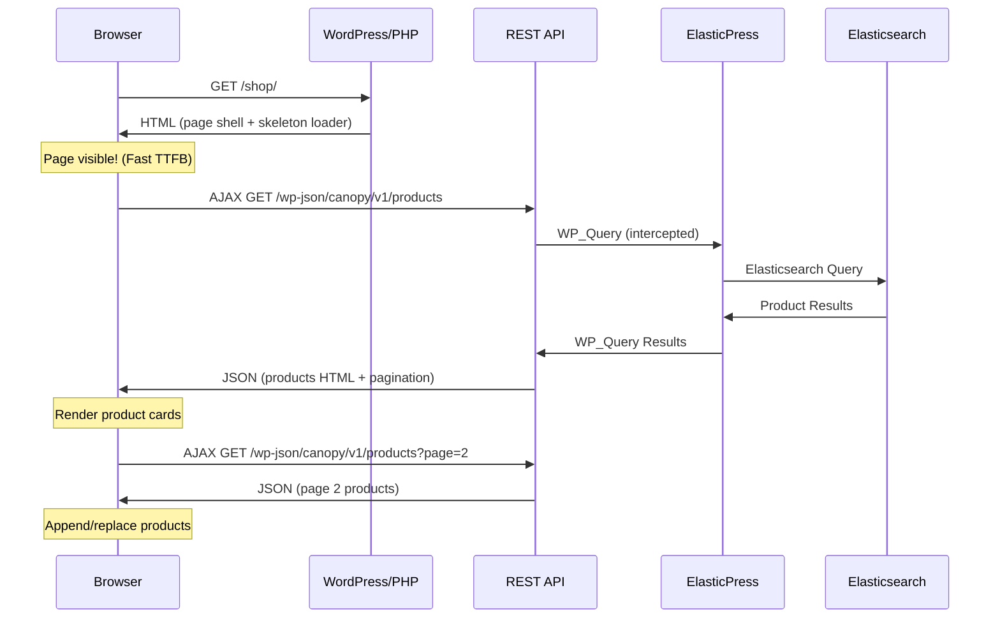

# Task 3: AJAX Product Loading (Lazy Load)

## Objective

Implementasi lazy-loading produk menggunakan AJAX + REST API sehingga halaman shop/kategori di-render lebih cepat. **Page shell** (header, sidebar, footer) di-load dulu, lalu produk dimuat secara asinkron via JavaScript → REST API → ElasticPress → Elasticsearch.

> [!IMPORTANT]
> Ini adalah task paling besar dan paling impactful dari keseluruhan planning. Task ini mengubah cara halaman shop me-render produk dari **synchronous** (blocking) menjadi **asynchronous** (non-blocking).

---

## Prerequisites

- [x] Task 1 selesai — ElasticPress terinstall & indexing selesai
- [x] Task 2 selesai — Search & filtering sudah berjalan via ES
- [ ] Memahami struktur template Ecomus theme

---

## Arsitektur AJAX Loading



---

## Step-by-Step Implementation

### 3.1 Buat Custom REST API Endpoint

**File: `wp-content/mu-plugins/06-canopy-ajax-products.php`**

```php
<?php
/**
 * Plugin Name: Canopy AJAX Products
 * Description: REST API endpoints for async product loading on shop/category pages.
 * Version: 1.0.0
 *
 * Provides WP REST API endpoints that query products via ElasticPress/Elasticsearch
 * and return rendered HTML fragments for client-side injection.
 */
if ( ! defined( 'ABSPATH' ) ) { exit; }

class Canopy_Ajax_Products {

    const NAMESPACE = 'canopy/v1';

    public function __construct() {
        add_action( 'rest_api_init', array( $this, 'register_routes' ) );
        add_action( 'wp_enqueue_scripts', array( $this, 'enqueue_scripts' ) );
    }

    /**
     * Register REST API routes.
     */
    public function register_routes() {
        register_rest_route( self::NAMESPACE, '/products', array(
            'methods'             => 'GET',
            'callback'            => array( $this, 'get_products' ),
            'permission_callback' => '__return_true',
            'args'                => $this->get_products_args(),
        ) );
    }

    /**
     * Define accepted query parameters.
     */
    private function get_products_args() {
        return array(
            'page' => array(
                'default'           => 1,
                'sanitize_callback' => 'absint',
            ),
            'per_page' => array(
                'default'           => intval( get_option( 'posts_per_page', 12 ) ),
                'sanitize_callback' => 'absint',
            ),
            'orderby' => array(
                'default'           => 'menu_order',
                'sanitize_callback' => 'sanitize_text_field',
            ),
            'order' => array(
                'default'           => 'ASC',
                'sanitize_callback' => 'sanitize_text_field',
            ),
            'category' => array(
                'default'           => '',
                'sanitize_callback' => 'sanitize_text_field',
            ),
            'search' => array(
                'default'           => '',
                'sanitize_callback' => 'sanitize_text_field',
            ),
            'min_price' => array(
                'default'           => '',
                'sanitize_callback' => 'sanitize_text_field',
            ),
            'max_price' => array(
                'default'           => '',
                'sanitize_callback' => 'sanitize_text_field',
            ),
            'attribute_pa_size' => array(
                'default'           => '',
                'sanitize_callback' => 'sanitize_text_field',
            ),
            'attribute_pa_color' => array(
                'default'           => '',
                'sanitize_callback' => 'sanitize_text_field',
            ),
            'stock_status' => array(
                'default'           => '',
                'sanitize_callback' => 'sanitize_text_field',
            ),
        );
    }

    /**
     * Handle product query and return rendered HTML.
     *
     * @param WP_REST_Request $request
     * @return WP_REST_Response
     */
    public function get_products( $request ) {
        $args = array(
            'post_type'      => 'product',
            'post_status'    => 'publish',
            'posts_per_page' => min( $request->get_param( 'per_page' ), 48 ),
            'paged'          => $request->get_param( 'page' ),
            'orderby'        => $request->get_param( 'orderby' ),
            'order'          => $request->get_param( 'order' ),
        );

        // Search query
        $search = $request->get_param( 'search' );
        if ( ! empty( $search ) ) {
            $args['s'] = $search;
        }

        // Category filter
        $category = $request->get_param( 'category' );
        if ( ! empty( $category ) ) {
            $args['tax_query'][] = array(
                'taxonomy' => 'product_cat',
                'field'    => 'slug',
                'terms'    => explode( ',', $category ),
            );
        }

        // Price filter
        $min_price = $request->get_param( 'min_price' );
        $max_price = $request->get_param( 'max_price' );
        if ( ! empty( $min_price ) || ! empty( $max_price ) ) {
            $meta_query = array( 'relation' => 'AND' );
            if ( ! empty( $min_price ) ) {
                $meta_query[] = array(
                    'key'     => '_price',
                    'value'   => intval( $min_price ),
                    'compare' => '>=',
                    'type'    => 'NUMERIC',
                );
            }
            if ( ! empty( $max_price ) ) {
                $meta_query[] = array(
                    'key'     => '_price',
                    'value'   => intval( $max_price ),
                    'compare' => '<=',
                    'type'    => 'NUMERIC',
                );
            }
            $args['meta_query'] = $meta_query;
        }

        // Attribute filters
        foreach ( array( 'pa_size', 'pa_color' ) as $taxonomy ) {
            $param = 'attribute_' . $taxonomy;
            $value = $request->get_param( $param );
            if ( ! empty( $value ) ) {
                $args['tax_query'][] = array(
                    'taxonomy' => $taxonomy,
                    'field'    => 'slug',
                    'terms'    => explode( ',', $value ),
                );
            }
        }

        // WooCommerce-specific orderby mapping
        $args = $this->map_wc_orderby( $args );

        // This WP_Query will be intercepted by ElasticPress → Elasticsearch
        $query = new \WP_Query( $args );

        // Render product cards HTML using WooCommerce templates
        ob_start();
        if ( $query->have_posts() ) {
            woocommerce_product_loop_start();
            while ( $query->have_posts() ) {
                $query->the_post();
                wc_get_template_part( 'content', 'product' );
            }
            woocommerce_product_loop_end();
        } else {
            echo '<p class="woocommerce-info">' . esc_html__( 'No products were found matching your selection.', 'woocommerce' ) . '</p>';
        }
        $html = ob_get_clean();
        wp_reset_postdata();

        // Render pagination
        ob_start();
        $this->render_pagination( $query );
        $pagination_html = ob_get_clean();

        return rest_ensure_response( array(
            'html'        => $html,
            'pagination'  => $pagination_html,
            'total'       => (int) $query->found_posts,
            'total_pages' => (int) $query->max_num_pages,
            'page'        => (int) $request->get_param( 'page' ),
        ) );
    }

    /**
     * Map WooCommerce orderby values to WP_Query args.
     */
    private function map_wc_orderby( $args ) {
        switch ( $args['orderby'] ) {
            case 'popularity':
                $args['meta_key'] = 'total_sales';
                $args['orderby']  = 'meta_value_num';
                $args['order']    = 'DESC';
                break;
            case 'rating':
                $args['meta_key'] = '_wc_average_rating';
                $args['orderby']  = 'meta_value_num';
                $args['order']    = 'DESC';
                break;
            case 'date':
                $args['orderby'] = 'date';
                $args['order']   = 'DESC';
                break;
            case 'price':
                $args['meta_key'] = '_price';
                $args['orderby']  = 'meta_value_num';
                $args['order']    = 'ASC';
                break;
            case 'price-desc':
                $args['meta_key'] = '_price';
                $args['orderby']  = 'meta_value_num';
                $args['order']    = 'DESC';
                break;
        }
        return $args;
    }

    /**
     * Render pagination HTML.
     */
    private function render_pagination( $query ) {
        if ( $query->max_num_pages <= 1 ) {
            return;
        }

        echo '<nav class="woocommerce-pagination canopy-ajax-pagination">';
        echo paginate_links( array(
            'total'   => $query->max_num_pages,
            'current' => max( 1, $query->get( 'paged' ) ),
            'format'  => '?paged=%#%',
            'type'    => 'list',
        ) );
        echo '</nav>';
    }

    /**
     * Enqueue frontend scripts and styles.
     */
    public function enqueue_scripts() {
        if ( ! is_shop() && ! is_product_taxonomy() && ! is_search() ) {
            return;
        }

        wp_enqueue_script(
            'canopy-ajax-products',
            $this->get_script_url(),
            array(),
            '1.0.0',
            true
        );

        wp_localize_script( 'canopy-ajax-products', 'canopyProducts', array(
            'restUrl'    => esc_url_raw( rest_url( self::NAMESPACE . '/products' ) ),
            'nonce'      => wp_create_nonce( 'wp_rest' ),
            'perPage'    => intval( get_option( 'posts_per_page', 12 ) ),
            'isShop'     => is_shop(),
            'isCategory' => is_product_taxonomy(),
            'category'   => is_product_taxonomy() ? get_queried_object()->slug : '',
            'i18n'       => array(
                'loading'    => __( 'Loading products...', 'canopy' ),
                'noProducts' => __( 'No products found.', 'canopy' ),
                'error'      => __( 'Failed to load products. Please try again.', 'canopy' ),
            ),
        ) );

        // Inline skeleton loader styles
        wp_add_inline_style( 'canopy-child', $this->get_skeleton_css() );
    }

    /**
     * Get the URL for the frontend JavaScript file.
     */
    private function get_script_url() {
        // Script will be created in canopy-child theme
        return get_stylesheet_directory_uri() . '/assets/js/ajax-products.js';
    }

    /**
     * Skeleton loader CSS for product cards.
     */
    private function get_skeleton_css() {
        return '
            .canopy-skeleton-grid {
                display: grid;
                grid-template-columns: repeat(auto-fill, minmax(250px, 1fr));
                gap: 20px;
                padding: 20px 0;
            }
            .canopy-skeleton-card {
                background: #fff;
                border-radius: 8px;
                overflow: hidden;
            }
            .canopy-skeleton-card .skeleton-image {
                width: 100%;
                padding-top: 133%;
                background: linear-gradient(90deg, #f0f0f0 25%, #e0e0e0 50%, #f0f0f0 75%);
                background-size: 200% 100%;
                animation: skeleton-pulse 1.5s ease-in-out infinite;
            }
            .canopy-skeleton-card .skeleton-text {
                height: 16px;
                margin: 12px 16px 8px;
                background: linear-gradient(90deg, #f0f0f0 25%, #e0e0e0 50%, #f0f0f0 75%);
                background-size: 200% 100%;
                animation: skeleton-pulse 1.5s ease-in-out infinite;
                border-radius: 4px;
            }
            .canopy-skeleton-card .skeleton-price {
                height: 14px;
                width: 40%;
                margin: 0 16px 16px;
                background: linear-gradient(90deg, #f0f0f0 25%, #e0e0e0 50%, #f0f0f0 75%);
                background-size: 200% 100%;
                animation: skeleton-pulse 1.5s ease-in-out infinite;
                border-radius: 4px;
            }
            @keyframes skeleton-pulse {
                0% { background-position: 200% 0; }
                100% { background-position: -200% 0; }
            }
            .canopy-products-container.is-loading {
                opacity: 0.5;
                pointer-events: none;
                transition: opacity 0.3s ease;
            }
            .canopy-products-container .canopy-fade-in {
                animation: canopyFadeIn 0.4s ease-in;
            }
            @keyframes canopyFadeIn {
                from { opacity: 0; transform: translateY(10px); }
                to { opacity: 1; transform: translateY(0); }
            }
        ';
    }
}

new Canopy_Ajax_Products();
```

---

### 3.2 Buat Frontend JavaScript

**File: `wp-content/themes/canopy-child/assets/js/ajax-products.js`**

```javascript
/**
 * Canopy AJAX Products — Frontend Controller
 *
 * Handles async product loading on shop/category pages.
 * Products are loaded via REST API after the page shell renders.
 */
(function () {
    'use strict';

    const config = window.canopyProducts || {};
    if (!config.restUrl) return;

    const SELECTORS = {
        productsContainer: '.products',
        paginationContainer: '.woocommerce-pagination',
        productLoop: 'ul.products',
        orderbyForm: '.woocommerce-ordering',
        orderbySelect: '.woocommerce-ordering .orderby',
        resultCount: '.woocommerce-result-count',
        sidebarFilters: '.widget_layered_nav, .widget_price_filter, .widget_rating_filter',
    };

    let currentParams = {
        page: 1,
        per_page: config.perPage || 12,
        orderby: 'menu_order',
        order: 'ASC',
        category: config.category || '',
        search: '',
        min_price: '',
        max_price: '',
    };

    /**
     * Generate skeleton loader HTML.
     */
    function createSkeletonHTML(count) {
        let html = '<div class="canopy-skeleton-grid">';
        for (let i = 0; i < count; i++) {
            html += `
                <div class="canopy-skeleton-card">
                    <div class="skeleton-image"></div>
                    <div class="skeleton-text"></div>
                    <div class="skeleton-text" style="width: 60%"></div>
                    <div class="skeleton-price"></div>
                </div>`;
        }
        html += '</div>';
        return html;
    }

    /**
     * Fetch products from REST API.
     */
    async function fetchProducts(params) {
        const url = new URL(config.restUrl);
        Object.keys(params).forEach(key => {
            if (params[key] !== '' && params[key] !== null) {
                url.searchParams.set(key, params[key]);
            }
        });

        const response = await fetch(url.toString(), {
            headers: {
                'X-WP-Nonce': config.nonce,
            },
        });

        if (!response.ok) {
            throw new Error(`HTTP ${response.status}`);
        }

        return response.json();
    }

    /**
     * Render products into the container.
     */
    function renderProducts(data) {
        const container = document.querySelector(SELECTORS.productsContainer)
            ?.closest('.shop-content-inner, .site-content, main');

        if (!container) return;

        // Replace product list
        const productList = container.querySelector(SELECTORS.productLoop);
        if (productList) {
            productList.outerHTML = data.html;
        }

        // Apply fade-in animation to new products
        const newProducts = container.querySelectorAll('.product');
        newProducts.forEach((el, i) => {
            el.style.animationDelay = `${i * 0.05}s`;
            el.classList.add('canopy-fade-in');
        });

        // Update pagination
        const pagination = container.querySelector(SELECTORS.paginationContainer);
        if (pagination) {
            pagination.outerHTML = data.pagination;
        } else if (data.pagination) {
            const loop = container.querySelector(SELECTORS.productLoop);
            if (loop) {
                loop.insertAdjacentHTML('afterend', data.pagination);
            }
        }

        // Update result count
        const resultCount = container.querySelector(SELECTORS.resultCount);
        if (resultCount) {
            resultCount.textContent = `Showing ${Math.min(data.total, currentParams.per_page)} of ${data.total} results`;
        }

        // Re-attach pagination click handlers
        attachPaginationHandlers();

        // Scroll to top of products
        const shopTop = container.querySelector(SELECTORS.productLoop);
        if (shopTop && currentParams.page > 1) {
            shopTop.scrollIntoView({ behavior: 'smooth', block: 'start' });
        }
    }

    /**
     * Load products with loading state.
     */
    async function loadProducts() {
        const container = document.querySelector(SELECTORS.productsContainer)
            ?.closest('.shop-content-inner, .site-content, main');

        if (!container) return;

        // Show loading state
        container.classList.add('canopy-products-container', 'is-loading');

        try {
            const data = await fetchProducts(currentParams);
            renderProducts(data);
        } catch (error) {
            console.error('Canopy AJAX Products Error:', error);
            // On error, keep existing products visible
        } finally {
            container.classList.remove('is-loading');
        }
    }

    /**
     * Attach click handlers to pagination links.
     */
    function attachPaginationHandlers() {
        document.querySelectorAll('.canopy-ajax-pagination a.page-numbers').forEach(link => {
            link.addEventListener('click', function (e) {
                e.preventDefault();
                const url = new URL(this.href);
                const page = url.searchParams.get('paged') || 1;
                currentParams.page = parseInt(page, 10);
                loadProducts();
            });
        });
    }

    /**
     * Attach sorting handler.
     */
    function attachSortingHandler() {
        const orderbySelect = document.querySelector(SELECTORS.orderbySelect);
        if (!orderbySelect) return;

        // Prevent form submission (default WooCommerce behavior)
        const form = orderbySelect.closest('form');
        if (form) {
            form.addEventListener('submit', function (e) {
                e.preventDefault();
            });
        }

        orderbySelect.addEventListener('change', function () {
            currentParams.orderby = this.value;
            currentParams.page = 1;
            loadProducts();
        });
    }

    /**
     * Initialize on DOM ready.
     */
    function init() {
        // Only initialize on shop/category pages
        if (!document.querySelector(SELECTORS.productsContainer)) return;

        attachSortingHandler();
        attachPaginationHandlers();

        // Note: Initial products are server-rendered by WooCommerce.
        // AJAX loading only activates for subsequent interactions
        // (pagination, sorting, filtering) — this is the safest approach
        // for SEO and first-paint performance.
    }

    if (document.readyState === 'loading') {
        document.addEventListener('DOMContentLoaded', init);
    } else {
        init();
    }
})();
```

---

### 3.3 Buat Assets Directory di canopy-child

```bash
mkdir -p wp-content/themes/canopy-child/assets/js/
```

Salin kode JavaScript di atas ke:
`wp-content/themes/canopy-child/assets/js/ajax-products.js`

---

### 3.4 Enqueue Script di canopy-child functions.php

Tidak perlu modifikasi `functions.php` — script di-enqueue oleh mu-plugin `06-canopy-ajax-products.php` yang sudah mencakup `wp_enqueue_scripts` hook.

---

### 3.5 SEO Considerations

> [!WARNING]
> **Full AJAX loading (produk tidak ada di HTML awal) = buruk untuk SEO.**
> 
> Strategi yang digunakan di planning ini adalah **Hybrid Approach**:
> 1. **Initial page load**: Produk tetap di-render server-side oleh WooCommerce (SEO friendly)
> 2. **Subsequent interactions** (pagination, sorting, filtering): Menggunakan AJAX
> 
> Dengan pendekatan ini, Google bot tetap bisa crawl produk dari HTML, sementara user mendapat pengalaman yang lebih cepat untuk interaksi selanjutnya.

Jika di kemudian hari ingin full AJAX (termasuk initial load), tambahkan:

```php
/**
 * Server-side rendering for bots (Googlebot, Bingbot, etc.).
 * Full AJAX only for real users.
 */
add_action( 'template_redirect', function () {
    if ( ! is_shop() && ! is_product_taxonomy() ) {
        return;
    }

    // Detect search engine bots
    $user_agent = strtolower( $_SERVER['HTTP_USER_AGENT'] ?? '' );
    $bots = array( 'googlebot', 'bingbot', 'yandexbot', 'baidubot', 'facebookexternalhit' );
    
    foreach ( $bots as $bot ) {
        if ( strpos( $user_agent, $bot ) !== false ) {
            // Let WooCommerce render normally for bots
            return;
        }
    }

    // For real users, set flag to use skeleton loader
    if ( ! defined( 'CANOPY_AJAX_PRODUCTS' ) ) {
        define( 'CANOPY_AJAX_PRODUCTS', true );
    }
} );
```

---

### 3.6 Fallback Mechanism

Jika Elasticsearch down, pastikan produk tetap bisa tampil:

**Tambahkan di `06-canopy-ajax-products.php`:**

```php
/**
 * Fallback: If Elasticsearch is unreachable, let WooCommerce query MariaDB directly.
 * ElasticPress sudah handle ini secara internal, tapi tambahkan logging.
 */
add_action( 'ep_failed_request', function ( $request, $context, $args ) {
    if ( defined( 'WP_DEBUG' ) && WP_DEBUG ) {
        error_log( '[Canopy ES Fallback] Elasticsearch request failed. Falling back to MariaDB. Context: ' . $context );
    }
}, 10, 3 );
```

---

## Checklist Verifikasi

- [ ] REST API endpoint accessible: `GET /wp-json/canopy/v1/products`
- [ ] API response contains `html`, `pagination`, `total`, `total_pages`
- [ ] Pagination via AJAX berfungsi (klik page 2 tidak reload halaman)
- [ ] Sorting via AJAX berfungsi (ubah orderby tidak reload halaman)
- [ ] Filter sidebar + AJAX berfungsi
- [ ] Skeleton loader / loading state tampil saat fetch
- [ ] Product cards animasi fade-in setelah loaded
- [ ] SEO: View page source → produk ada di HTML awal (server-rendered)
- [ ] Fallback: Matikan ES container → halaman tetap berfungsi via MariaDB

---

## File yang Dibuat/Dimodifikasi

| File | Aksi | Deskripsi |
|------|------|-----------|
| `wp-content/mu-plugins/06-canopy-ajax-products.php` | **NEW** | REST API endpoint + script enqueue |
| `wp-content/themes/canopy-child/assets/js/ajax-products.js` | **NEW** | Frontend AJAX controller |

---

> [!TIP]
> Setelah Task 3 selesai, lanjut ke **[Task 4: Performance Optimization](file:///c:/laragon/www/tcr-wordpress/ai-task/04-performance-optimization.md)**.
