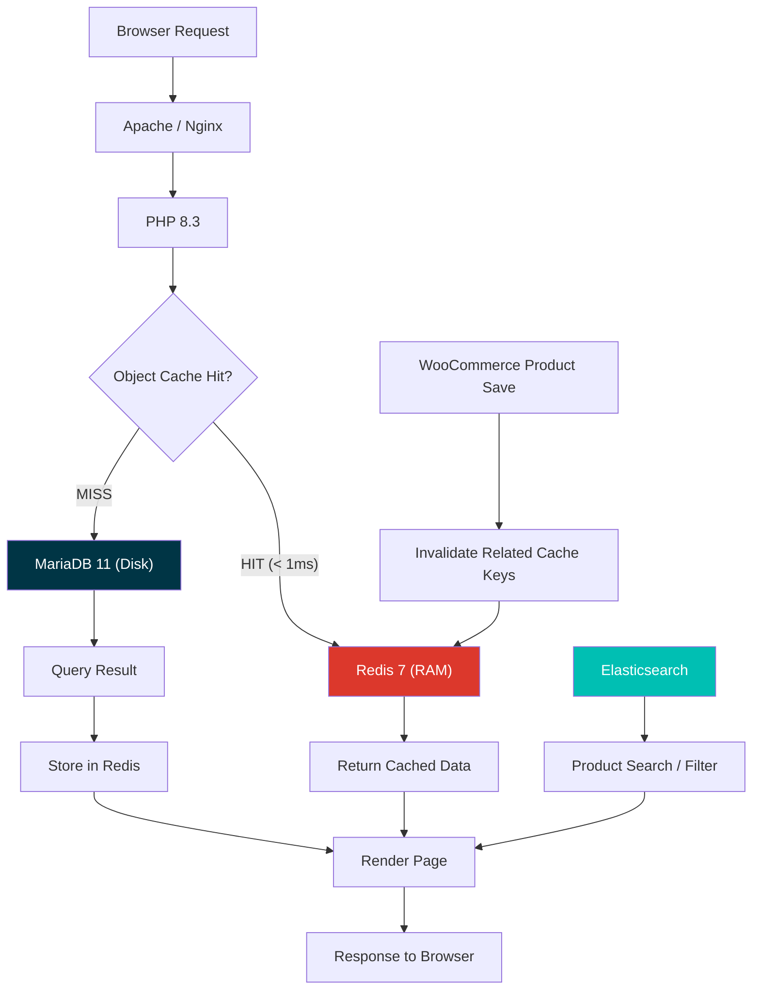

# Redis Object Cache — Master Plan

## Gambaran Umum

Implementasi Redis sebagai **Object Cache** pada The Canopy Room WordPress/WooCommerce untuk mengeliminasi bottleneck PHP bootstrapping yang menyebabkan semua halaman memerlukan ~5 detik untuk merespon di lingkungan lokal.

### Masalah Saat Ini

Berdasarkan hasil benchmark yang telah dilakukan:

| Halaman | Response Time | Catatan |
|---------|--------------|---------|
| Home (`/`) | 5.064 ms | Tidak ada produk di halaman |
| Shop (`/shop/`) | 5.041 ms | Produk sudah di-AJAX, tetap lambat |
| Cart (`/cart/`) | 4.627 ms | Halaman statis, tetap lambat |
| REST API (`/wp-json/canopy/v1/products`) | 4.820 ms | Query ES hanya 0,09 detik |

**Root Cause:** WordPress harus memuat **25 plugin aktif** di setiap request. Setiap plugin melakukan ratusan `get_option()`, `get_transient()`, dan query ke MariaDB. Tanpa Object Cache, semua data ini di-query ulang dari disk database di **setiap single request**.

### Solusi: Redis Object Cache

Redis menyimpan seluruh WordPress Object Cache (options, transients, user sessions, WooCommerce cart/session data) di **RAM** sehingga:

```
SEBELUM Redis:
  Browser → Apache → PHP Boot (5s) → 25 Plugin Load → 300+ SQL Queries → MariaDB (disk) → Response

SESUDAH Redis:
  Browser → Apache → PHP Boot → 25 Plugin Load → Redis (RAM, <1ms per key) → Response
  Target: < 500ms total (10x improvement)
```

---

## Current Environment Status

| Component | Status |
|-----------|--------|
| PHP Redis Extension (Laragon) | ❌ Belum terinstall |
| PHP Redis Extension (Docker) | ❌ Belum terinstall |
| Redis Server | ❌ Belum ada |
| `object-cache.php` Drop-in | ❌ Belum ada |
| `WP_CACHE` constant | ❌ `false` |
| `WP_REDIS_HOST` constant | ❌ Not defined |
| Active Plugins | 25 plugin |

---

## Arsitektur Target



### Caching Layer (Complete Stack)

```
┌──────────────────────────────────────────────────────────┐
│  Layer 1: Browser Cache (Static Assets, Images)          │
├──────────────────────────────────────────────────────────┤
│  Layer 2: CDN (Future — Cloudflare/Bunny)                │
├──────────────────────────────────────────────────────────┤
│  Layer 3: Page Cache (Future — Nginx FastCGI Cache)      │
├──────────────────────────────────────────────────────────┤
│  Layer 4: Redis Object Cache  ◄── IMPLEMENTASI SEKARANG │
├──────────────────────────────────────────────────────────┤
│  Layer 5: Elasticsearch (Product Search)  ◄── SUDAH DONE│
├──────────────────────────────────────────────────────────┤
│  Layer 6: MariaDB (Source of Truth)       ◄── SUDAH ADA │
└──────────────────────────────────────────────────────────┘
```

---

## Task Breakdown

Planning ini dipecah menjadi **4 task** yang harus dikerjakan secara berurutan:

| Task | File | Deskripsi | Estimasi |
|------|------|-----------|----------|
| 1 | [07-redis-infrastructure.md](./07-redis-infrastructure.md) | Setup Redis server (Laragon + Docker), install PHP Redis extension | 1-2 jam |
| 2 | [08-redis-wordpress-integration.md](./08-redis-wordpress-integration.md) | Install & konfigurasi Redis Object Cache plugin, wp-config.php, drop-in | 1-2 jam |
| 3 | [09-redis-woocommerce-optimization.md](./09-redis-woocommerce-optimization.md) | Optimasi WooCommerce session, cart, transient, fragment cache | 2-3 jam |
| 4 | [10-redis-testing-monitoring.md](./10-redis-testing-monitoring.md) | Benchmark before/after, monitoring dashboard, health check, production checklist | 1-2 jam |

---

## Keputusan Arsitektur

### Mengapa Redis (bukan Memcached)?

| Kriteria | Redis | Memcached |
|----------|-------|-----------|
| Data Persistence | ✅ RDB + AOF (data survive restart) | ❌ Volatile (hilang saat restart) |
| Data Types | ✅ Strings, Lists, Sets, Hashes, Sorted Sets | ⚠️ Strings only |
| WooCommerce Sessions | ✅ Native support via sorted sets | ⚠️ Workaround needed |
| WordPress Plugin Support | ✅ Redis Object Cache (mature, aktif) | ⚠️ Lebih sedikit opsi |
| Pub/Sub (Cache Invalidation) | ✅ Built-in | ❌ Tidak ada |
| Replication | ✅ Master-Replica | ⚠️ Terbatas |
| Memory Efficiency | ✅ Compression, eviction policies | ⚠️ Slab allocator |

**Keputusan**: Gunakan **Redis 7 Alpine** untuk ukuran container minimal (~30MB) dan performa maksimal.

### Mengapa Redis Object Cache Plugin (bukan custom drop-in)?

| Kriteria | Redis Object Cache Plugin | Custom Drop-in |
|----------|--------------------------|----------------|
| Setup time | ⚡ 5 menit | 🐌 Beberapa jam |
| WP Admin Dashboard | ✅ Health check, stats, flush | ❌ Manual |
| WooCommerce aware | ✅ Session handling built-in | ❌ Manual |
| Maintenance | ✅ Auto-update via WP | ⚠️ Manual |
| Customization | ✅ Hooks & filters | ✅ Full control |

**Keputusan**: Gunakan **Redis Object Cache** plugin by Till Krüss (most popular, 1M+ installs, actively maintained).

---

## Dual Environment Strategy

Project ini berjalan di **2 environment** yang berbeda:

| | Laragon (Local Dev) | Docker (Staging/Prod) |
|--|--------------------|-----------------------|
| **PHP** | Laragon PHP 8.3 (Windows) | wordpress:php8.3-apache |
| **Redis Server** | Laragon built-in Redis | Docker `redis:7-alpine` container |
| **Redis Extension** | `php_redis.dll` (Windows) | `pecl install redis` (Linux) |
| **Connection** | `127.0.0.1:6379` | `wp_redis:6379` |

> [!IMPORTANT]
> Konfigurasi harus **environment-aware** — MU-Plugin akan auto-detect apakah berjalan di Laragon atau Docker dan menggunakan host yang sesuai (mirip dengan yang sudah dilakukan di `04-elasticpress-config.php`).

---

## Risiko & Mitigasi

| Risiko | Dampak | Mitigasi |
|--------|--------|----------|
| Redis server down | Object cache fallback ke MariaDB (lebih lambat, tapi tetap jalan) | Health check cron + auto-restart Docker |
| Memory penuh di Redis | Eviction policy menghapus key lama | Set `maxmemory` 256MB + `allkeys-lru` policy |
| Stale cache data | User melihat data lama setelah update produk | WooCommerce hooks invalidate cache otomatis |
| PHP Redis extension tidak ter-load | Fatal error atau silent fallback | Graceful detection di MU-Plugin |
| Cache stampede saat flush | Semua request hit DB bersamaan | Gradual warm-up script |

---

## Prasyarat

- [x] Docker Compose environment running
- [x] Laragon environment running
- [x] MariaDB accessible
- [x] Elasticsearch + ElasticPress running
- [x] 25 plugin aktif (target utama caching)
- [ ] Redis server installed (Task 1)
- [ ] PHP Redis extension installed (Task 1)
- [ ] Redis Object Cache plugin configured (Task 2)
- [ ] WooCommerce cache optimization (Task 3)
- [ ] Benchmark & monitoring (Task 4)

---

> [!TIP]
> Mulai dari **Task 1 (07-redis-infrastructure.md)** untuk install Redis server dan PHP extension. Setiap task file berisi instruksi detail, kode, dan checklist verifikasi.
