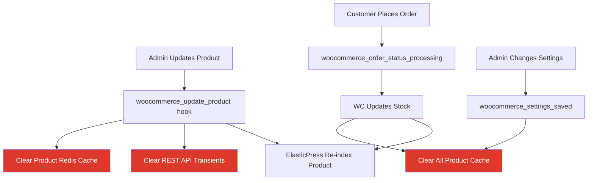

# Task 3: Redis WooCommerce Optimization

## Objective

Optimasi caching khusus WooCommerce yang merupakan sumber utama query berat: sessions, cart data, product transients, fragment cache, dan REST API responses. Integrasi dengan Elasticsearch yang sudah berjalan.

---

## Prerequisites

- [x] Task 1 selesai (Redis server running)
- [x] Task 2 selesai (Redis Object Cache plugin aktif, status "Connected")
- [x] ElasticPress + AJAX product loading berjalan
- [ ] Baseline metrics sebelum WooCommerce optimization

---

## Step-by-Step Implementation

### 3.1 WooCommerce Session Handler Optimization

WooCommerce menyimpan cart/session data di database table `cnp_woocommerce_sessions`. Dengan 25+ plugin aktif, setiap pageview melakukan beberapa query ke tabel ini. Redis mengeliminasi query tersebut.

#### 3.1.1 Analisis Session Load Saat Ini

```php
<?php
define('WP_USE_THEMES', false);
require_once __DIR__ . '/wp-load.php';

global $wpdb;

// Count active sessions
$sessions = $wpdb->get_var("SELECT COUNT(*) FROM {$wpdb->prefix}woocommerce_sessions");
echo "Active WC Sessions: {$sessions}\n";

// Average session size
$avg_size = $wpdb->get_var("SELECT AVG(LENGTH(session_value)) FROM {$wpdb->prefix}woocommerce_sessions");
echo "Average Session Size: " . round($avg_size / 1024, 2) . " KB\n";

// Expired sessions (cleanup needed)
$expired = $wpdb->get_var($wpdb->prepare(
    "SELECT COUNT(*) FROM {$wpdb->prefix}woocommerce_sessions WHERE session_expiry < %d",
    time()
));
echo "Expired Sessions: {$expired}\n";
```

> [!NOTE]
> WooCommerce sessions **otomatis** menggunakan Redis jika Object Cache aktif dan `WC_Session_Handler` mendeteksinya. Tidak perlu konfigurasi tambahan untuk fitur ini.

---

### 3.2 WooCommerce Transient Optimization

WooCommerce menyimpan banyak transient di database: product counts, shipping rates, tax rates, dll. Dengan Redis, transient ini di-cache di RAM.

#### 3.2.1 Buat MU-Plugin WooCommerce Cache Optimization

Buat file `wp-content/mu-plugins/09-canopy-wc-cache.php`:

```php
<?php
/**
 * Plugin Name: Canopy WooCommerce Cache Optimization
 * Description: Optimasi WooCommerce caching dengan Redis integration.
 * Version: 1.0.0
 */

if ( ! defined( 'ABSPATH' ) ) {
    exit;
}

class Canopy_WC_Cache {

    /**
     * Cache TTL constants (in seconds).
     */
    const PRODUCT_COUNT_TTL    = 3600;    // 1 hour
    const SHIPPING_RATE_TTL    = 1800;    // 30 minutes
    const WIDGET_CACHE_TTL     = 3600;    // 1 hour
    const CATEGORY_COUNT_TTL   = 3600;    // 1 hour
    const LAYERED_NAV_TTL      = 3600;    // 1 hour

    public function __construct() {
        // Only run if Redis Object Cache is active
        if ( ! wp_using_ext_object_cache() ) {
            return;
        }

        // Product count caching
        add_filter( 'woocommerce_product_query_meta_query', array( $this, 'cache_product_meta_queries' ), 10, 2 );

        // Cache WooCommerce widget output
        add_filter( 'woocommerce_layered_nav_count_maybe_cache', '__return_true' );

        // Optimize transient storage
        add_action( 'woocommerce_delete_product_transients', array( $this, 'smart_transient_cleanup' ) );

        // Cache cart fragments more aggressively
        add_filter( 'woocommerce_cart_fragments_group', array( $this, 'cart_fragments_cache_group' ) );

        // Optimize product visibility queries
        add_filter( 'woocommerce_product_query', array( $this, 'cache_product_visibility' ), 5 );

        // Admin: Show cache stats in WooCommerce status page
        add_action( 'woocommerce_system_status_report', array( $this, 'display_cache_stats' ) );
    }

    /**
     * Cache product meta queries to reduce repetitive DB lookups.
     */
    public function cache_product_meta_queries( $meta_query, $query ) {
        // Generate a cache key based on the meta query
        $cache_key = 'canopy_pmq_' . md5( serialize( $meta_query ) );
        $cached    = wp_cache_get( $cache_key, 'canopy_wc' );

        if ( false !== $cached ) {
            return $cached;
        }

        // Store for later caching in 'posts_results' filter
        $query->set( 'canopy_meta_cache_key', $cache_key );

        return $meta_query;
    }

    /**
     * Selectively clear transients instead of flushing everything.
     */
    public function smart_transient_cleanup( $product_id = 0 ) {
        // Clear product-specific cache
        if ( $product_id ) {
            wp_cache_delete( 'canopy_product_' . $product_id, 'canopy_wc' );
        }

        // Clear REST API product cache (from 06-canopy-ajax-products.php)
        $this->clear_rest_api_cache();

        // Clear category count cache
        wp_cache_delete( 'canopy_cat_counts', 'canopy_wc' );
    }

    /**
     * Clear REST API product transients.
     */
    private function clear_rest_api_cache() {
        global $wpdb;

        // Delete canopy REST API transients
        $wpdb->query(
            "DELETE FROM {$wpdb->options} 
             WHERE option_name LIKE '_transient_canopy_products_%'
             OR option_name LIKE '_transient_timeout_canopy_products_%'"
        );

        // Also clear the Redis cached versions
        if ( function_exists( 'wp_cache_delete_group' ) ) {
            wp_cache_delete_group( 'canopy_rest' );
        }
    }

    /**
     * Use dedicated cache group for cart fragments.
     */
    public function cart_fragments_cache_group( $group ) {
        return 'canopy_cart_fragments';
    }

    /**
     * Cache product visibility term IDs.
     */
    public function cache_product_visibility( $query ) {
        $visibility = wp_cache_get( 'canopy_product_visibility_ids', 'canopy_wc' );

        if ( false === $visibility ) {
            $visibility = wc_get_product_visibility_term_ids();
            wp_cache_set( 'canopy_product_visibility_ids', $visibility, 'canopy_wc', self::PRODUCT_COUNT_TTL );
        }
    }

    /**
     * Display cache stats on WooCommerce Status page.
     */
    public function display_cache_stats() {
        if ( ! class_exists( 'Redis' ) ) {
            return;
        }

        try {
            $redis = new \Redis();
            $redis->connect( WP_REDIS_HOST, WP_REDIS_PORT, 1 );

            $info   = $redis->info( 'stats' );
            $mem    = $redis->info( 'memory' );
            $keys   = $redis->dbSize();
            $hits   = $info['keyspace_hits'] ?? 0;
            $misses = $info['keyspace_misses'] ?? 0;
            $ratio  = ( $hits + $misses > 0 ) ? round( $hits / ( $hits + $misses ) * 100, 1 ) : 0;

            echo '<table class="wc_status_table" cellspacing="0">';
            echo '<thead><tr><th colspan="3" data-export-label="Redis Cache"><h2>Redis Cache</h2></th></tr></thead>';
            echo '<tbody>';
            echo '<tr><td>Status</td><td>🟢 Connected</td></tr>';
            echo '<tr><td>Memory Used</td><td>' . round( $mem['used_memory'] / 1024 / 1024, 2 ) . ' MB</td></tr>';
            echo '<tr><td>Total Keys</td><td>' . number_format( $keys ) . '</td></tr>';
            echo '<tr><td>Cache Hit Ratio</td><td>' . $ratio . '% (' . number_format( $hits ) . ' hits / ' . number_format( $misses ) . ' misses)</td></tr>';
            echo '</tbody></table>';

            $redis->close();
        } catch ( \RedisException $e ) {
            echo '<p>Redis: ❌ ' . esc_html( $e->getMessage() ) . '</p>';
        }
    }
}

new Canopy_WC_Cache();
```

---

### 3.3 Integrasi Redis dengan Existing REST API Cache

File `06-canopy-ajax-products.php` sudah menggunakan WordPress transients untuk caching REST API responses. Dengan Redis aktif, transients otomatis disimpan di Redis (bukan database).

#### 3.3.1 Upgrade REST API Cache ke Direct Redis

Update method `get_products` di `06-canopy-ajax-products.php` untuk menggunakan `wp_cache_*` langsung (lebih efisien dari transients saat Redis aktif):

```php
/**
 * Enhanced caching: Use wp_cache (Redis) instead of transients.
 * Falls back to transients if Redis not available.
 */
public function get_cached_products( $cache_key, $callback ) {
    // Try Redis object cache first (0.001ms hit time)
    if ( wp_using_ext_object_cache() ) {
        $cached = wp_cache_get( $cache_key, 'canopy_rest' );
        if ( false !== $cached ) {
            return $cached;
        }

        $data = $callback();
        wp_cache_set( $cache_key, $data, 'canopy_rest', 300 ); // 5 min TTL
        return $data;
    }

    // Fallback: WordPress transients (stored in DB)
    $cached = get_transient( $cache_key );
    if ( false !== $cached ) {
        return $cached;
    }

    $data = $callback();
    set_transient( $cache_key, $data, 300 );
    return $data;
}
```

---

### 3.4 Product Lookup Table Cache

WooCommerce's `wc_product_meta_lookup` table is queried frequently for price ranges, stock status, and ratings. Cache these aggregate queries.

```php
/**
 * Cache product price range for layered navigation.
 */
add_filter( 'woocommerce_price_filter_results', function( $results, $min, $max ) {
    if ( ! wp_using_ext_object_cache() ) {
        return $results;
    }

    $cache_key = 'canopy_price_range_' . md5( $min . '_' . $max );
    $cached    = wp_cache_get( $cache_key, 'canopy_wc' );

    if ( false !== $cached ) {
        return $cached;
    }

    wp_cache_set( $cache_key, $results, 'canopy_wc', 3600 );
    return $results;
}, 10, 3 );
```

---

### 3.5 Fragment Cache untuk Ecomus Theme

Ecomus theme memiliki beberapa widget/block yang di-render di setiap pageview. Cache output mereka di Redis.

```php
/**
 * Cache heavy theme fragments.
 */
add_action( 'init', function() {
    if ( ! wp_using_ext_object_cache() || is_admin() ) {
        return;
    }

    // Cache navigation menu output
    add_filter( 'pre_wp_nav_menu', function( $nav_menu, $args ) {
        if ( empty( $args->theme_location ) ) {
            return $nav_menu;
        }

        $cache_key = 'canopy_menu_' . $args->theme_location . '_' . md5( serialize( $args ) );
        $cached    = wp_cache_get( $cache_key, 'canopy_fragments' );

        if ( false !== $cached ) {
            return $cached;
        }

        return $nav_menu; // Let WordPress generate it, we'll cache in wp_nav_menu filter
    }, 10, 2 );

    add_filter( 'wp_nav_menu', function( $nav_menu, $args ) {
        if ( empty( $args->theme_location ) ) {
            return $nav_menu;
        }

        $cache_key = 'canopy_menu_' . $args->theme_location . '_' . md5( serialize( $args ) );
        wp_cache_set( $cache_key, $nav_menu, 'canopy_fragments', 3600 );

        return $nav_menu;
    }, 10, 2 );
}, 1 );
```

---

### 3.6 Cache Invalidation Strategy

> [!IMPORTANT]
> Cache invalidation yang tepat sangat krusial. Cache yang stale menyebabkan user melihat data lama (harga salah, stok salah, dll).

#### 3.6.1 Invalidation Hooks

```php
/**
 * WooCommerce cache invalidation hooks.
 * Add to 09-canopy-wc-cache.php
 */

// Product created/updated/deleted
add_action( 'woocommerce_update_product', 'canopy_invalidate_product_cache' );
add_action( 'woocommerce_new_product', 'canopy_invalidate_product_cache' );
add_action( 'before_delete_post', function( $post_id ) {
    if ( 'product' === get_post_type( $post_id ) ) {
        canopy_invalidate_product_cache( $post_id );
    }
});

// Order completed (stock changes)
add_action( 'woocommerce_order_status_completed', 'canopy_invalidate_all_product_cache' );
add_action( 'woocommerce_order_status_processing', 'canopy_invalidate_all_product_cache' );

// Coupon changes
add_action( 'woocommerce_coupon_options_save', 'canopy_invalidate_all_product_cache' );

// Settings changed
add_action( 'woocommerce_settings_saved', 'canopy_invalidate_all_product_cache' );

function canopy_invalidate_product_cache( $product_id = 0 ) {
    // Clear specific product cache
    wp_cache_delete( 'canopy_product_' . $product_id, 'canopy_wc' );
    
    // Clear REST API transients for this product's categories
    // (so category pages reflect changes)
    global $wpdb;
    $wpdb->query(
        "DELETE FROM {$wpdb->options} 
         WHERE option_name LIKE '_transient_canopy_products_%'
         OR option_name LIKE '_transient_timeout_canopy_products_%'"
    );
}

function canopy_invalidate_all_product_cache() {
    // Nuclear option: clear all canopy caches
    if ( function_exists( 'wp_cache_flush_group' ) ) {
        wp_cache_flush_group( 'canopy_wc' );
        wp_cache_flush_group( 'canopy_rest' );
        wp_cache_flush_group( 'canopy_fragments' );
    }
    
    // Clear WooCommerce transients
    wc_delete_product_transients();
}
```

#### 3.6.2 Invalidation Flow Diagram



---

## Verifikasi Checklist

- [ ] MU-Plugin `09-canopy-wc-cache.php` created dan berfungsi
- [ ] WooCommerce sessions menggunakan Redis
  ```bash
  redis-cli keys "*wc_session*"
  ```
- [ ] WooCommerce transients di Redis
  ```bash
  redis-cli keys "*transient*wc*"
  ```
- [ ] REST API cache menggunakan `wp_cache` (Redis-backed)
- [ ] Cache invalidation berjalan saat product update
- [ ] WooCommerce Status page menampilkan Redis stats
- [ ] Fragment cache aktif untuk navigation menus
- [ ] No stale data setelah product update

---

## Output Task Ini

Setelah task ini selesai, kita akan memiliki:

1. ✅ WooCommerce sessions, transients, dan cart fragments di-cache di Redis
2. ✅ REST API responses di-cache langsung di Redis (bukan DB transients)
3. ✅ Fragment cache untuk theme menus dan widgets
4. ✅ Cache invalidation strategy yang tepat
5. ✅ Redis stats visible di WooCommerce Status page
6. ✅ Siap untuk Task 4: Testing & Monitoring

---

> [!TIP]
> Lanjut ke **Task 4 (10-redis-testing-monitoring.md)** untuk benchmark before/after, monitoring, dan production deployment checklist.
